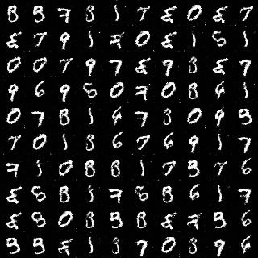
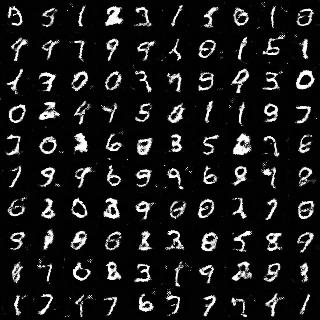
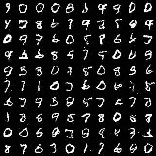

# gan_practice
simple dcgan,wgan and improved wgan implementation by tensorflow, this is for practice purpose. tensorflow version=1.1.0

# data preparation
download MNIST data from http://yann.lecun.com/exdb/mnist/ and unzip data to some dir,for example
```sh
data
|__ 10k-images-idx3-ubyte
|__ train-images-idx3-ubyte
```

# training
```sh
python dcgan.py or wgan.py or wgan_gp.py \
                --data_path=data \
                --mode=train \
                --model_dir=models \
                --batch_size=100 \
                --epoch_num=100 \
                --rand_dim=128
```

# generating
```sh
python dcgan.py or wgan.py or wgan_gp.py \
                --data_path=data \
                --mode=infer \
                --model_dir=models \
                --batch_size=100 \
                --epoch_num=100 \
                --rand_dim=128
```

# some results
* dcgan 100 epoch results
<p align="center">

</p>
* wgan 100 epoch results
<p align="center">

</p>
* improved wgan 100 epoch results
<p align="center">

</p>

# reference
* Generative Adversarial Nets
* Unsupervised Representation Learning with Deep Convolutional Generative Adversarial Networks
* Wasserstein GAN
* Improved Training of Wasserstein GANs
* https://github.com/carpedm20/DCGAN-tensorflow
* https://github.com/shekkizh/WassersteinGAN.tensorflow
* https://github.com/igul222/improved_wgan_training


